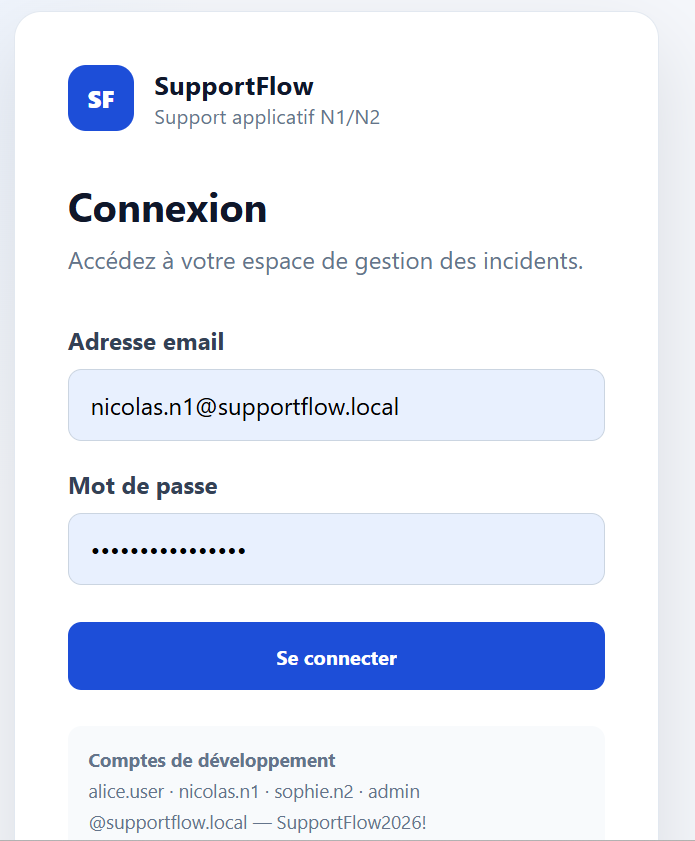
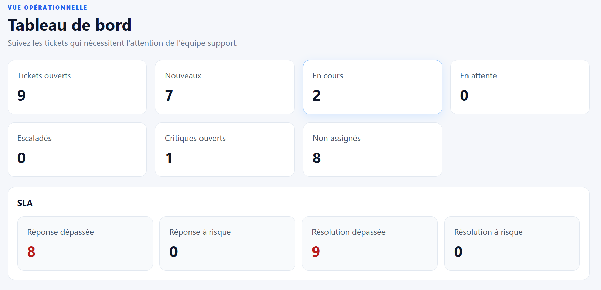
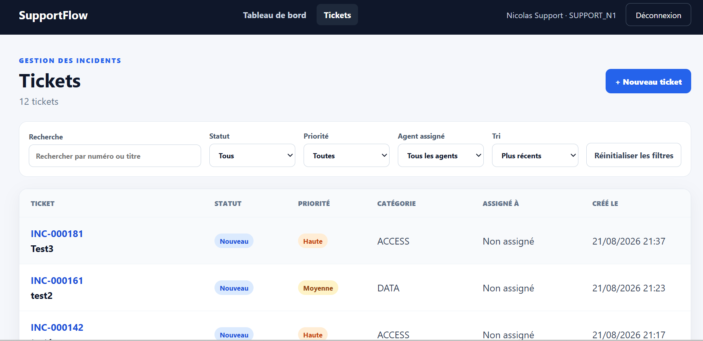
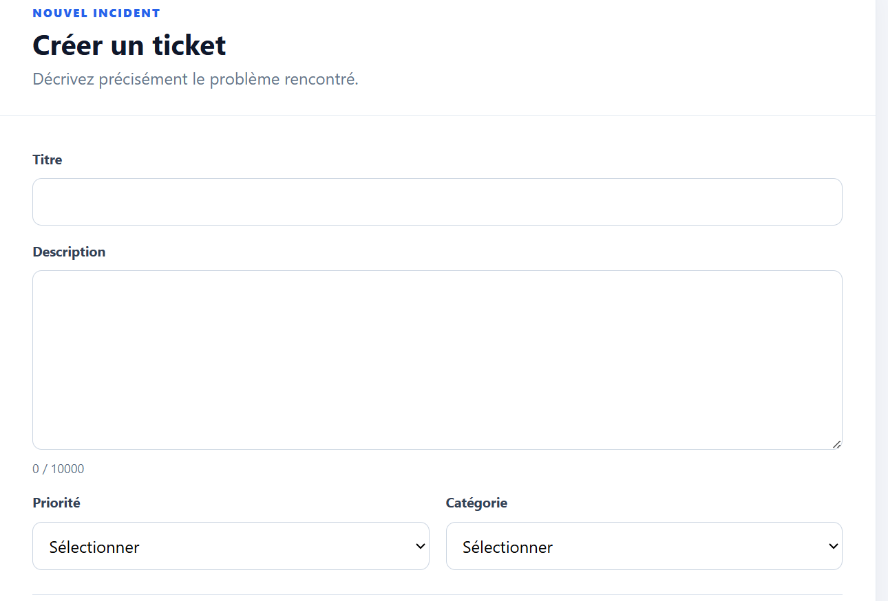
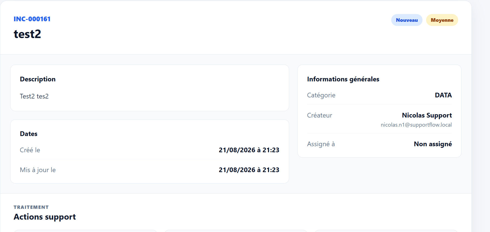
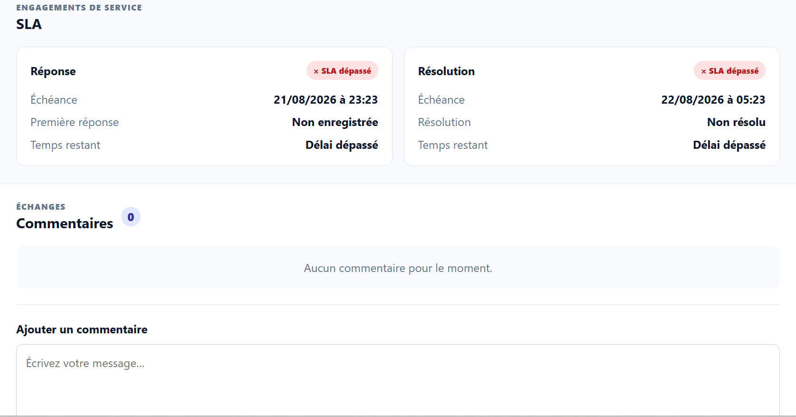
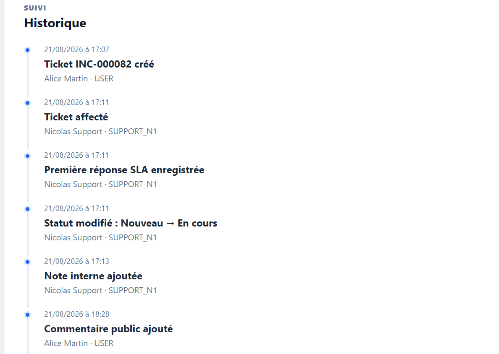
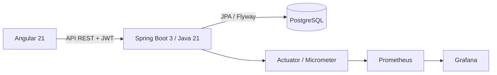

# SupportFlow

SupportFlow est une application professionnelle de gestion des tickets et incidents pour une équipe de support applicatif N1/N2. Elle centralise le cycle de vie d’un incident, la collaboration, le suivi des SLA et l’observabilité de la plateforme.

## Fonctionnalités

- authentification stateless par JWT ;
- RBAC `USER`, `SUPPORT_N1`, `SUPPORT_N2` et `ADMIN` ;
- création de tickets, recherche, filtres, tri et pagination ;
- affectation et escalade N1 vers N2 ;
- cycle de vie `NEW`, `IN_PROGRESS`, `WAITING`, `ESCALATED`, `RESOLVED`, `CLOSED` ;
- commentaires publics et notes internes ;
- historique chronologique des changements ;
- SLA de première réponse et de résolution ;
- dashboard support, résolution, réouverture et fermeture ;
- observabilité Prometheus/Grafana et alerting.

## Aperçu de l'application

### Authentification



La page de connexion initialise la session JWT et permet d’accéder à l’espace correspondant au rôle de l’utilisateur.

### Dashboard support



Le tableau de bord N1/N2 synthétise les tickets ouverts, leur répartition et les échéances SLA nécessitant une attention.

### Gestion des tickets



La liste propose une recherche ainsi que des filtres par statut, priorité et agent assigné.



Le formulaire guide la saisie de l’incident, de sa priorité et de sa catégorie.

### Fiche ticket et actions support



La fiche centralise le statut, la priorité, la description, les acteurs et les actions disponibles selon le cycle de vie.



Le suivi présente les échéances SLA et les échanges publics ou internes associés au ticket.

### Historique



La chronologie conserve les événements importants : création, affectation, première réponse, transitions et commentaires.

## Architecture



Le backend reste la source d’autorité pour les permissions et le filtrage des données. Le frontend adapte uniquement l’expérience à l’utilisateur connecté.

## Stack technique

| Domaine | Technologies |
|---|---|
| Backend | Java 21, Spring Boot, Spring Web, Spring Security, JWT, Spring Data JPA, Validation, Flyway, Maven |
| Frontend | Angular 21, TypeScript, Reactive Forms, composants standalone |
| Base de données | PostgreSQL |
| Observabilité | Actuator, Micrometer, Prometheus, Grafana |
| Infrastructure | Docker Compose |
| Tests | JUnit 5, Spring Boot Test, MockMvc, tests Angular/Vitest |

## Rôles

- **USER** : crée des tickets, consulte ses demandes et publie des commentaires publics.
- **SUPPORT_N1** : prend en charge les tickets, ajoute des notes internes et escalade vers le N2.
- **SUPPORT_N2** : traite les incidents escaladés et apporte l’expertise de niveau 2.
- **ADMIN** : dispose de capacités opérationnelles étendues et des endpoints de développement protégés.

## Workflow d’un incident

```text
USER crée un ticket
→ SUPPORT_N1 le prend en charge
→ échanges publics et notes internes
→ escalade vers SUPPORT_N2 si nécessaire
→ résolution
→ fermeture
```

Un ticket résolu peut être rouvert vers `IN_PROGRESS`. Un ticket fermé est terminal.

## SLA

SupportFlow calcule deux échéances UTC à la création : première réponse et résolution.

| Priorité | Première réponse | Résolution |
|---|---:|---:|
| Critique | 15 minutes | 2 heures |
| Haute | 30 minutes | 4 heures |
| Moyenne | 2 heures | 8 heures |
| Faible | 4 heures | 24 heures |

Le backend expose un résumé SLA sans déléguer les règles métier au frontend.

## Observabilité

Le profil `dev` expose les endpoints Actuator nécessaires à Prometheus. Les métriques couvrent la JVM, HTTP, HikariCP et les événements métier (tickets créés, résolus, escaladés et commentaires ajoutés).

Le dashboard Grafana **SupportFlow - Application Overview** est provisionné automatiquement. Prometheus charge trois règles versionnées :

- `SupportFlowDown` : indisponibilité pendant une minute ;
- `HighHttp5xxRate` : plus de 0,1 erreur 5xx par seconde pendant cinq minutes ;
- `HikariPoolNearSaturation` : pool utilisé à au moins 80 % pendant deux minutes.

Les alertes sont visibles sur `http://localhost:9090/alerts`. Aucun canal de notification externe n’est configuré.

## Installation locale

### Prérequis

- Java 21 et Maven 3.9+ ;
- Node.js compatible avec Angular 21 et npm ;
- Docker Desktop avec Docker Compose.

### 1. Configuration

```powershell
Copy-Item .env.example .env
```

Remplacer dans `.env` les placeholders par des secrets locaux. Ce fichier est ignoré par Git.

### 2. PostgreSQL

```powershell
docker compose --env-file .env up -d postgres
```

### 3. Backend

Charger `.env` dans PowerShell :

```powershell
Get-Content .env |
  Where-Object { $_ -match '^[A-Za-z_][A-Za-z0-9_]*=' } |
  ForEach-Object {
    $name, $value = $_ -split '=', 2
    Set-Item -Path "Env:$name" -Value $value
  }
```

Puis démarrer Spring Boot :

```powershell
mvn spring-boot:run -Dspring-boot.run.profiles=dev
```

Flyway applique le schéma et les données réservées au profil de développement.

### 4. Frontend

```powershell
Set-Location frontend
npm ci
npm start
```

### 5. Prometheus et Grafana

Avec le backend démarré :

```powershell
docker compose --env-file .env up -d prometheus grafana
```

La datasource et le dashboard sont provisionnés automatiquement. Pour arrêter sans supprimer les volumes :

```powershell
docker compose stop
```

## URLs locales

| Service | URL |
|---|---|
| Frontend Angular | http://localhost:4200 |
| Backend Spring Boot | http://localhost:8080 |
| Santé API | http://localhost:8080/api/health |
| Swagger UI | http://localhost:8080/swagger-ui.html |
| Métriques Actuator | http://localhost:8080/actuator/prometheus |
| Prometheus | http://localhost:9090 |
| Grafana | http://localhost:3000 |

## Tests

```powershell
# Backend
mvn clean test

# Frontend
Set-Location frontend
npm test
npm run build
```

## Sécurité

- les secrets locaux restent dans `.env`, exclu du dépôt ;
- `.env.example` ne contient que des placeholders ;
- les mots de passe utilisateurs sont stockés sous forme de hash ;
- les requêtes authentifiées utilisent un JWT Bearer ;
- le RBAC et le filtrage des tickets sont appliqués côté backend ;
- les entités JPA ne sont pas exposées directement ;
- les endpoints Actuator sont limités à `health`, `info` et `prometheus` en développement ;
- l’accès anonyme aux métriques est réservé au profil `dev`.

## Captures d’écran

Les captures du dashboard, de la liste des tickets et de la fiche détaillée pourront être ajoutées dans [`docs/screenshots`](docs/screenshots) avant publication.

## Améliorations futures

- notifications des alertes via un canal externe sécurisé ;
- métriques SLA agrégées dédiées ;
- pipeline CI/CD avec contrôles de qualité ;
- conteneurisation complète de l’application ;
- déploiement cloud.
